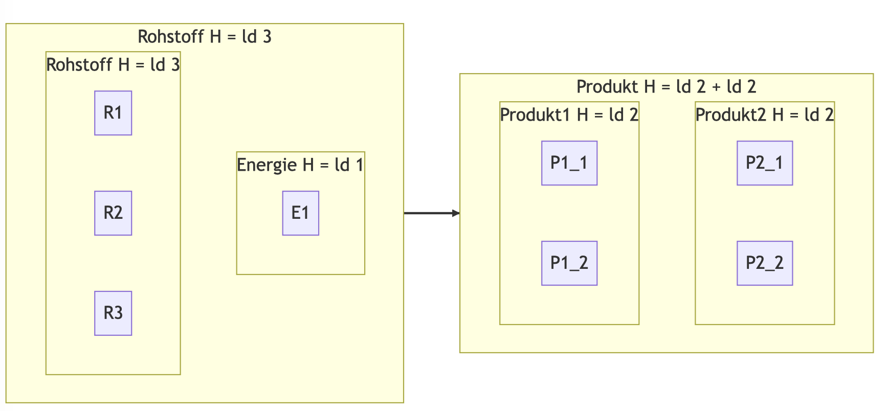

\begin{titlepage}
    \begin{center}
        \vspace*{1cm}

        \textbf{ENTROPIE EINES WIRTSCHAFTSSYSTEMS}
        \vspace{0.5cm}

        Modellierung
        \vspace{1.5cm}

        \textbf{Daniel Meiborg}
        \vfill

        SIA - Schüler-Ingenieur-Akademie

        \vspace{0.8cm}

        \includegraphics[width=\textwidth]{../logo-birklehof.jpg}
        \includegraphics[width=\textwidth]{../logo-sia.jpg}

        \vspace{0.8cm}

        Frau Dr. Hardung, Herr Dr. Itzen, Hr. Vogelgesang

        Schule Birklehof e.V.

        2022/2023
    \end{center}
\end{titlepage}

\newpage
\renewcommand{\contentsname}{Inhaltsverzeichnis}
\tableofcontents
\newpage

# Modellierung

## Einleitung

Ein grundlegender Ansatz in der Wissenschaft besteht darin, komplexe Phänomene
zu vereinfachen und in mathematische Modelle zu überführen. In den
Wirtschaftswissenschaften gibt es eine Vielzahl von Modellen, die dazu dienen,
wirtschaftliche Zusammenhänge abzubilden. Ein entscheidender Aspekt der in
dieser Arbeit betrachteten und entwickelten Modelle ist, dass sie den zweiten
Hauptsatz der Thermodynamik erfüllen müssen. In diesem Kapitel werde ich mehrere
Ansätze vorstellen, um Modelle zu entwicklen, die diese Anforderung erfüllen.

## Ausgleichsterme

Die meisten der folgenden Modelle basieren auf die eine oder andere Weise auf
Markov-Prozessen. Ziel ist es, ein Modell so für den zugrundeliegenden
Sachverhalt zu erstellen, dass dieser Markov-Prozess den zweiten Hauptsatz der
Thermodynamik erfüllt. Nachdem das ein Spezialfall von Markov-Prozessen ist, ist
es unwahrscheinlich, dass der erste Versuch dieses Kriterium erfüllt. Aus diesem
Grund kann man modellkonforme Ausgleichsterme einführen. Diese dienen als
Negentropie-Quelle oder als Entropieablage. Beispiele dafür befinden sich in
[Atomare Operationen](#atomare-operationen).

## Agentenbasierter Markov-Prozess

Bei einem agentenbasiertem Markov-Prozess versucht man, ökonomische Agenten
(Staat, Banken etc.) annähernd zu modellieren. Agenten sind hier im Sinne der
Spieltheorie als Entititäten, die mit ihrer Umwelt agieren können, zu verstehen.
Der erste Schritt ist hier das Verhalten einzelnen Agenten mithilfe von z.B.
Entscheidungsdiagrammen (siehe [Beispiel](#beispiel)) in eine Form zu
übersetzen, die sich dann weiterverarbeiten lässt.

Im nächsten Schritt muss dieses Modell dann in einen Markov-Prozess umgewandelt
werden. Eine Möglichkeit dafür ist die Bibliothek Entromatica
[@meiborg2023entromatica].

Dieser Markov-Prozess lässt sich dann vergleichsweise einfach simulieren. Aus
der daraus zu berechnenden Entropie (siehe [Entropie](#entropie)) oder direkt
aus der Übergangswahrscheinlichkeitsmatrix kann man nun berechnen, ob der zweite
Hauptsatz der Thermodynamik gilt - was höchstwahrscheinlich nicht der Fall ist.
Um weitere Analysen zu ermöglichen, müssen modellkonforme Ausgleichsterme
eingeführt werden. Dementsprechend muss man das Ausgangsmodell sukzessive
anpassen.

### Entropie

Die Entropie wird hier wie bereits im Kapitel zu den theoretischen Grundlagen
beschreiben anhand der Shannon-Entropie der möglichen Zustände definiert. Die
Wahrscheinlichkeitsverteilung $X_0$ ist zu Beginn bekannt, und die Entropie wird
als Funktion über die Zeit dargestellt. Diesem Prinzip folgen auch alle anderen
auf Markov-Prozessen basierenden hier vorgestellten Modelle.

### Beispiel

Im Folgenden ist ein Diagramm zu sehen, was vereinfacht mögliche Zustände eines
Kaufprozesses auf der Seite des Käufers und die jeweiligen
Übergangswahrscheinlichkeiten darstellt. ‘Stabil’ bezeichnet hier den
Ausgangszustand. In diesem Szenario entschließt sich der Agent von Zeit zu Zeit,
ein Produkt zu kaufen, und erfährt dabei ab und zu Betrug. Das führt dann dazu,
dass er für eine Zeit lang im ‘Abbruch’ Zustand feststeckt d.h. aufgrund der
Betrugserfahrung vorsichtiger ist.


### Vorteile

Da ein tatsächliches Wirtschaftssystem ebenfalls aus einer Vielzahl an Agenten
besteht, hat dieses System das Potential, bei idealer Umsetzung gute Ergebnisse
zu liefern.

### Probleme

Dabei treten jedoch einige Probleme auf: Zunächst einmal ist die Modellierung
von menschlichen Agenten extrem aufwendig, schwierig oder schlicht unmöglich.
Auch bei sehr simplen Systemen müssen eine Vielzahl an Parametern willkürlich
gesetzt werden, da die Datenlage und die Verarbeitungskapazität in der Regel
sehr limitiert sind. Des weiteren sind die Ausgleichsterme in Vergleich zu den
folgenden Ansätzen schwieriger zu implementieren, da sie erfordern, dass
entweder neue Agenten hinzukommen, oder bisherige ihre Entscheidungen radikal
verändern, was die Aussagekraft des Modells weiter beeinträchtigt.

## Diffusionsbasierter Markov-Prozess

Das Vorgehen bei diffusionsbasierten Markov-Prozessen ist ähnlich wie bei
agentenbasierten Markov-Prozessen. Der Hauptunterschied besteht allerdings
darin, dass anstatt alle Agenten weitestgehend einzeln zu modellieren, lediglich
grobkörnig die Flüsse von Kapitel bzw. Ressourcen angegeben werden. Da solche
Austausche in der Regel auf einem Austausch bestehen, die genauen Zeitpunkte
jedoch nur schwer vorausgesagt werden können, wird hier von Diffusion
gesprochen.

### Beispiel

Auf diesem Diagramm sind schematische Beziehungen zwischen ökonomischen
Entitäten zu sehen. Im nächsten Schritt müssen hier Wahrscheinlichkeiten für
Diffusion und Quantitäten angegeben werden.


### Vorteile

Ein wesentlicher Vorteil dieses Ansatzes ist, dass Entscheidungen von Agenten
von Anfang an als nicht vorhersagbar angenommen werden. Tatsächlich ist diese
Unvorhersagbarkeit hier hilfreich, da Zufall für Markov-Prozesse ein
essentielles Element ist. Stattdessen werden lediglich die größeren
Zusammenhänge beachtet.

### Probleme

Allerdings kann bei dem Versuch, das Wirtschaftssystem auf einer niedrigeren
Ebene zu modellieren, dieses Konzept in eine kompliziertere Version der
agentenbasierten Version ausarten. Es muss also immer zwischen den beiden
Ansätzen abgewogen werden.

## Entropiebasiertes Wirtschaftssystem

Der nächste Ansatz besteht darin, lediglich diejenigen Teile der Wirtschaft zu
betrachten, die sich  selbst mit Wahrscheinlichkeiten beschäftigen. Dieses
breite Feld umfasst alles von Versicherungen, Glücksspiel bis hin zu
Kryptowährungen. Hier können sowohl reale Systeme betrachtet werden, als auch
fiktive Wirtschaftssysteme, in denen beispielsweise reine Information eine
Währung ist.

### Beispiel

Ein Beispiel dafür ist ein virtuelles Pferderennen: In diesem ist die einzigen
Information, die das ansonsten geschlossene System (z.B. ein Computer) verlässt,
der (eindeutige) Gewinner. Bei 8 Pferden sind das 3 Bit Information. Vor Beginn
des Zufallexperiments gibt es also 3 Bit Ungewissheit; danach sind es 0 Bit (auf
das Pferderennen bezogen). Nun kann man einen Markov-Prozess aus dem
Pferderennen und Umgebung erstellen. Um diesen nach dem zweiten Hauptsatz zu
modellieren (der, unseres Wissens nach, auf die Physik zutrifft), muss diese
Pferderennen-Simulation dabei an mindestens 3 Bit Entropie zunehmen. Anhand des
Landauer Prinzips lässt sich ein Minimum an Energie festlegen, welches benötigt
wird, um ein Bit zu löschen. Die Argumentation ist mit dem Beispiel für die
Thermodynamik im Kapitel über die theoretischen Grundlagen verwandt. Dieses wird
mithilfe der Boltzmann Konstante berechnet: $E = k_BT\ln(2)$
[@landauer1961limit]. Die 3 Bit entsprechen bei Raumtemperatur etwa $0,0175
\cdot 3 = 0,0525 eV$, die in Wärme konvertiert werden müssen. Bei einem Preis
von etwa 0,33€/kWh 2022 in Deutschland [@destatis2022electricity] sind das etwa
$8,714 \cdot 10^{-16}$ €, die der Ausgang mindestens wert ist. So könnte man in
einer Gesellschaft prinzpiell Information als tatsächlichen Wertgegenstand
einsetzen.

### Vorteile

Da die Branche direkt an Wahrscheinlichkeiten orientiert ist, hat der Begriff
der Entropie hier mehr Aussagekraft als bei den generischen agenten- oder
diffusionsbasierten Modellen.

### Probleme

Allerdings wird für reelle Wirtschaftszweige deutlich, dass die Entropie, die
man bei der Spekulation erhält, in aller Regel nicht dem entspricht, was eine
solche Berechnung ergeben würde, da solche Systeme nicht vollständig
abgeschlossen sind und Information nach außen dringen kann.

## Markup Sprache

Während die bisherigen Modellierungsmöglichkeiten darauf beruhen, ein bestimmtes
Wirtschaftssystem zu modellieren und dessen die Entropie zu berechnen, wird bei
diesem Ansatz gewissermaßen die Entropie aller möglichen Wirtschaftssysteme
berechnet.

Im ersten Schritt wird dazu eine Markup Sprache definiert. Das kann
beispielsweise ein XML Dialekt sein. Danach kann man für eine bestimmte maximale
Länge eines solchen Dokuments i.e. Wirtschaftssystems die Anzahl an allen
möglichen verschiedenen Systemen berechnen. Hierbei muss die tatsächliche
Struktur verschieden sein, nicht nur die Benennung der Variablen. Wenn man alle
Dokumente als gleich wahrscheinlich annimmt, kann man damit den
Informationsgehalt eines einzelnen Dokuments berechnen.

### Evolutionäre Algorithmen

Optional kann man den so berechneten Informationsgehalt mit beispielsweise
genetischen Algorithmen kombinieren, um eine Veränderung der
Wahrscheinlichkeiten über Zeit zu erhalten. Hier würde man verschiedener solcher
Systeme mutieren lassen, und die Veränderung der Entropie betrachte. Da zu
Beginn alle möglichen Systeme als gleich wahrscheinlich angenommen werden, sinkt
demnach die Entropie, wenn sich einzelne Wirtschaftssysteme als effektiver
herausstellen. Wie in dem Beispiel für entropiebasierte Wirtschaftssysteme
illustriert, lässt sich daraus auch die Menge an Information bzw. Energie
berechnen, die dafür aufgewendet werden muss. Voraussetzung dafür ist
allerdings, dass man eine Funkton definieren kann, die die Effektivität eines
Wirtschaftssystems berechnet.

### Beispiel

```xml
<economy>
  <agents>
    <agent id="A1" type="producer" capacity="100" />
    <agent id="A2" type="consumer" />
    <agent id="A3" type="producer" capacity="50" />
  </agents>
  <products>
    <product id="P1" producer="A1" />
    <product id="P2" producer="A3" />
  </products>
  <connections>
    <connection type="market" producer="A1" consumer="A2"
			product="P1" quantity="50" price="10" />
    <connection type="market" producer="A3" consumer="A2"
			product="P2" quantity="25" price="5" />
    <connection type="gift" producer="A1" consumer="A2"
			product="P1" quantity="10" />
    <connection type="loan" lender="A2" borrower="A3"
			amount="100" interest_rate="0.05" />
  </connections>
</economy>
```

### Vorteile

Der wesentliche Vorteil hier ist, dass man die Entropie der *Struktur* der
Wirtschaftssysteme berechnen kann anstatt die Entropie ihres Verhaltens. Dadurch
muss man nicht den schwierigen Schritt gehen und die einzelnen Agenten
simulieren.

### Probleme

Allerdings kann ohne weitere Modifikationen der 2. Hauptsatz der Thermodynamik
nicht angewendet werden, da die Dokumente kein Markov-Prozess sind. Ein Ansatz,
dieses Problem zu umgehen besteht in [Evolutionäre Algorithmen](#evolutionäre-algorithmen).

## Atomare Operationen

Im Gegensatz zu den bisherigen Modellen werden hier mikroökonomische Prozesse
anstatt von makroökonomischen Strukturen betrachtet. Anstatt die Struktur eines
Wirtschaftssystems zu analysieren, versucht man einfache ökonomische Prozesse
mit Markov-Prozessen zu modellieren und wenn nötig Ausgleichsterme einzuführen.

### Beispiel

Eine solche atomare Operation könnte zum Beispiel die Produktion von Gütern aus
Rohstoffen sein. In dem folgendem Diagramm kann man einen solchen Prozess sehen.
Es gibt in diesem Markov-Prozess zwei Gruppen von Zuständen: *Rohstoff* und
*Produkt*. Zum Zeitpunkt $t=0$ ist unbekannt, welcher der drei möglichen
Zustände R1, R2 oder R3 von dem Rohstoff tatsächlich eingenommen wird d.h. alle
haben eine Wahrscheinlichkeit von $\frac{1}{3}$ und die
Wahrscheinlichkeitsverteilung damit die Entropie $H(X_0) = \text{ld}(3)$. Diese
Zustände können der molekularen Struktur von beispielsweise Kohle entsprechen.
Während die Struktur von Kohle relativ undefiniert ist, kann man die die
Struktur von z.B. Graphen deutlich genauer bestimmen. Zum Zeitpunkt $t=1$
wechseln diese Zustände zufällig entweder zu P1 oder P2. Die Entropie ist somit
$H(X_0) = \text{ld}(2) = 1 \text{bit}$.


Um den zweiten Hauptsatz der Thermodynamik zu erfüllen, kann man nun das Modell
auf mehrere Arten erweitern. Eine solche Möglichkeit ist die Einführung von
Energie als Edukt (z.B. in Form von Photonen). Hier ist es wichtig zu beachten,
dass ein R1, R2, R3 und E1 keine getrennten Zustände sind, die die Edukte
einnehmen können, sondern ein konkreter Zustand des Markov-Prozesses aus der
Kombination (R1, E1), (R2, E1) oder (R3, E1) besteht. Dementsprechend bleibt die
Gesamtentropie von $X_0$ gleich. Basis für die Annahme der geringen Anzahl an
Zuständen der ‘Energie’ ist, dass es weniger Zustände für beispielsweise
Photonen gibt (um genau zu sein $H = k(1-\ln(f_r)$ mit $f_r$ die
Photonenverteilung und $k$ die Boltzmann Konstante [@kirwan2004photons])
als für eine bestimmte Menge von z.B. Kohle. Die Zugabe von Energie bedingt
i.d.R. eine höhere Quantität an Produkten. Da es auf der Produktseite nun 4
Zustände gibt (P1_1, P2_1), (P1_1, P2_2), (P1_2, P2_1), (P1_2, P2_2), beträgt
die Entropie von $X_1$ $H(X_1) = \text{ld}(4) = 2 \text{bit}$.



Eine andere Möglichkeit ist Abfall. Dabei wird angenommen, dass bei der
Produktion eine gewisse Menge an undefinierbarem Abfall entsteht. Dieser hat
hier eine hohe Anzahl an möglichen Zuständen (5). Das Entropieverhältnis ist
hier also $H(X_0) = \text{ld}(3) \approx 1,585 \text{bit}$ und $H(X_1) =
\text{ld}(2 \cdot 5) = \text{ld}(2) + \text{ld}(5) \approx 3,322 \text{bit}$.


### Vorteile

Im Gegensatz zu den anderen Modellen ist dieser Ansatz vergleichsweise
anschaulich und nachvollziehbar. Des Weiteren muss man dazu nicht das Verhalten
von Agenten voraussagen, was die Umsetzbarkeit dramatisch erhöht.

### Probleme

Allerdings ist dieser kleinschrittige Ansatz kaum umsetzbar auf einer
makroökonomischen Ebene. Hier verschwimmen auch die Grenzen zu den ersten beiden
Modellen.

## Fazit

Agenten- und diffusionsbasierte Modelle sind also geeignet um die Entropie des
Verhaltens eines einzelnen Wirtschaftssystems zu analysieren. Für den Vergleich
der Struktur hingegen ist eine Markup Sprache eher geeignet. Mit atomaren
Operationen kann man ökonomische Prozesse auf einer niedrigeren Ebene
betrachten.

Agenten- und diffusionsbasierte Modelle bieten geeignete Ansätze, um die
Entropie des Verhaltens eines einzelnen Wirtschaftssystems zu analysieren und
ökonomische Prozesse auf einer höheren Ebene zu betrachten. Jedoch sind diese
Modelle aufgrund ihrer Komplexität schwer zu interpretieren und zu skalieren.
Für den Vergleich der Struktur eines Wirtschaftssystems ist hingegen eine Markup
Sprache eher geeignet, da dabei die Agenten nicht simuliert werden
müssen.Schließlich ermöglichen atomare Operationen, ökonomische Prozesse auf
einer niedrigeren Ebene zu betrachten.

Zusammenfassend kann gesagt werden, dass das Thema der Entropie in einem
Wirtschaftssystem ein interdisziplinärer Ansatz ist, der die Verbindung von
naturwissenschaftlichen und gesellschaftswissenschaftlichen Konzepten aufzeigt.
Die Anwendung des zweiten Hauptsatzes der Thermodynamik auf ökonomische Modelle
ermöglicht es, komplexe Prozesse in einem Wirtschaftssystem besser zu verstehen
und zu erklären. Die vorgestellten Ansätze bieten dabei unterschiedliche
Möglichkeiten der Modellierung, welche jeweils eigene Vor- und Nachteile
aufweisen.

## Ausblick

Die vorgestellten Ansätze zur Entropie-Analyse in Wirtschaftssystemen bieten
vielversprechende Möglichkeiten für weitere Forschung. Ein vielversprechender
nächster Schritt wäre die weitere Entwicklung und Umsetzung atomarer
Operationen.

Eine weitere Möglichkeit zur Weiterentwicklung wäre die Weiterentwicklung des
Konzepts der Anwendung von genetischen Algorithmen bei Markup Sprachen.

## Quellen