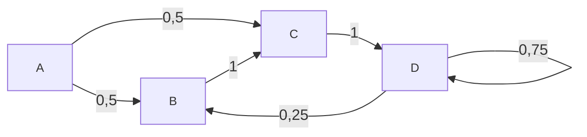
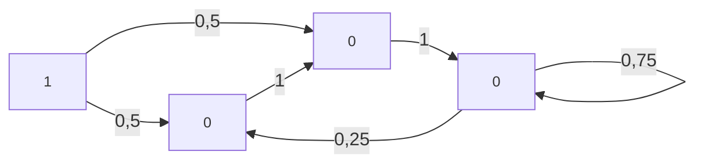
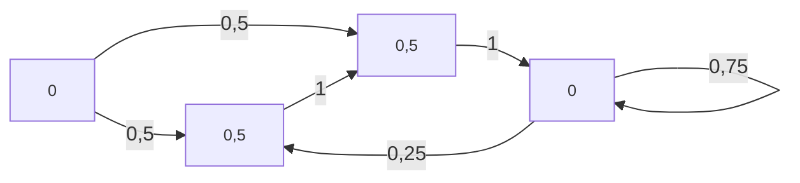
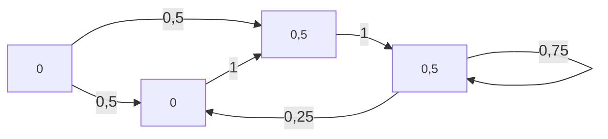
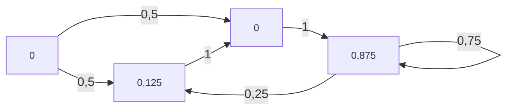
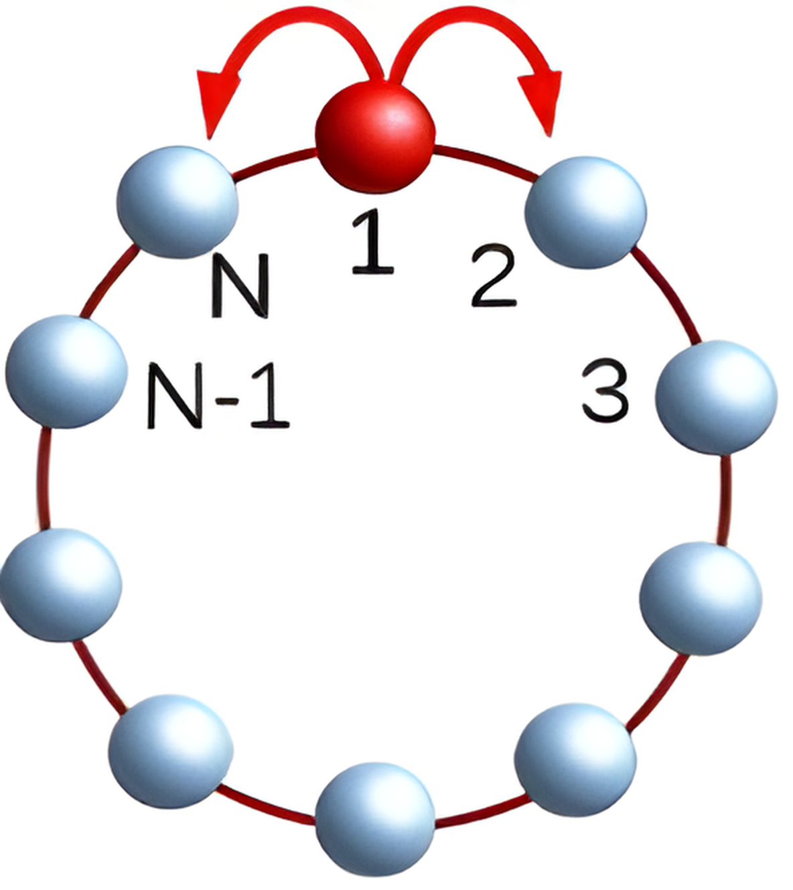

# Entropie eines Wirtschaftssystems {.r-fit-text}

Theorethische Grundlagen

<figure style="font-size: 20px">
  <blockquote>
    

      You should call it entropy [...] no one really knows what entropy really is, so in a debate you will always have the advantage.
    

  </blockquote>
  <figcaption style="font-size: 15px">
    John von Neumann zu Claude Shannon, Scientific American Vol. 225 No. 3, (1971)</i>
  </figcaption>
</figure>

---

## Information

---

### Eigenschaften

`$$I: \Omega \to \mathbb{R}_{\geq 0}$$` {.fragment}

`$$A, B \in \Omega: p(A) < p(B) \implies I(B) < I(A)$$` {.fragment}

`$$A \in \Omega: p(A) = 1 \implies I(A) = 0$$` {.fragment}

`$$A \in \Omega: p(A) \approx 0 \implies I(A) \approx \infty$$` {.fragment}

`$$A \perp\!\!\!\perp B \implies I(A \cap B) = I(A) + I(B)$$` {.fragment}

---

### Definition

`$$I(x) \mapsto - \log_2p(x)$$`

---

### Beispiel 1

Sei `$\Omega = \{ K, Z \}$`

`$$p(K) = \frac{1}{2}; p(Z) = \frac{1}{2}$$`

`$$\implies I(K) = 2; I(Z) = 2$$`

---

### Beispiel 2

Sei `$\Omega = \{ K, Z \}$`

`$$p(K) = \frac{1}{3}; p(Z) = \frac{2}{3}$$`

`$$\implies I(K) \approx 1,585; I(Z) = 0,585$$`

---

## Entropie

---

### Arten von Entropie

- Von-Neumann-Entroie {.fragment}
- Thermodynamische Entropie {.fragment}
- Statistische Mechanik {.fragment}
- Reaktionsentropie {.fragment}
- ==Shannon-Entropie== {.fragment}

---

### Definition

Erwartungswert der Information

`$$H(X) = \mathbb{E}_X[I(X)]$$`

`$$H(X) = - \sum_{x \in X}p(x)\log_2p(x)$$` {.fragment}

---

### Beispiel 1

Sei `$\Omega = \{ K, Z \}$`

`$$p(K) = \frac{1}{2}; p(Z) = \frac{1}{2}$$`

`$$\implies I(K) = 2; I(Z) = 2$$`

`$$\implies H(\Omega) = 2 * \frac{1}{2} + 2 * \frac{1}{2} = 1$$`

---

### Beispiel 2

Sei `$\Omega = \{ K, Z \}$`

`$$p(K) = \frac{1}{3}; p(Z) = \frac{2}{3}$$`

`$$\implies I(K) \approx 1,585; I(Z) = 0,585$$`

`$$\implies H(\Omega) \approx \frac{1}{3} * 1,585 + \frac{2}{3} * 0,585 = 0,918$$`

---

### Bedingte Entropie

<!-- Sei $H(X|Y) = \sum_{x,y}p(y)p(x|y)\log_2{p(x|y)}$ die bedingte Entropie von $X$
unter der Bedingung $Y$. $H(X|Y)$ ist nie größer als $H(X)$ und nur gleich, wenn
$Y$ vollkommen unabhängig von $X$ ist. Das lässt sich anschaulich so erklären,
dass zusätzliche Information ($Y$) nicht Wissen über $X$ zerstören kann, sondern
höchstens vollkommen irrelevant sein kann. -->

`$$H(X|Y) = \sum_{x,y}p(y)p(x|y)\log_2{p(x|y)}$$`

Entropie von `$X$` mit der gegebenen Information über `$Y$`

---

### Relative Entropie

Maß für Unterschiedlichkeit zweier Wahrscheinlichkeitsverteilungen $p$ und $r$

`$$D(p||r) = \sum_x p(x)\log_2{\frac{p(x)}{r(x)}}$$`

`$$D(p||r) \ge 0$$`

Keine Metrik

---

## Markov-Prozesse

---

### Definition

- Zustandsmenge: `$X$` {.fragment}
- Wahrscheinlichkeitsverteilung zu Zeitpunkt `$t$`: `$\vec{P}(t)$` {.fragment}
- Markov-Eigenschaft: `$\vec{P}(t+1)$` hängt ausschließlich von `$\vec{P}(t)$` ab {.fragment}
- Übergangsmatrix: `$A_{ij}$` {.fragment}
- Mastergleichung: `$\vec{P}(t+1) = A\vec{P}(t)$` {.fragment}

---

### Beispiel

Zustandsmenge: `$\{A,B,C,D\}$`

`$$A = \begin{bmatrix}
0 & 0 & 0 & 0 \\
0,5 & 0 & 0 & 0,25 \\
0,5 & 1 & 0 & 0 \\
0 & 0 & 1 & 0,75
\end{bmatrix}$$`

---

`$\vec{P}(0) = \begin{bmatrix} 1 \\ 0 \\ 0 \\ 0 \end{bmatrix}$`

`$$H(\vec{P}(0)) = 0$$`

---

`$\vec{P}(1) = A \begin{bmatrix} 1 \\ 0 \\ 0 \\ 0 \end{bmatrix}
= \begin{bmatrix} 0 \\ 0,5 \\ 0,5 \\ 0 \end{bmatrix}$`

`$$H(\vec{P}(1)) = 1$$`

---

`$\vec{P}(2) = A^2 \begin{bmatrix} 1 \\ 0 \\ 0 \\ 0 \end{bmatrix}
= \begin{bmatrix} 0 \\ 0 \\ 0,5 \\ 0,5 \end{bmatrix}$`

`$$H(\vec{P}(2)) = 1$$`

---

`$\vec{P}(3) = A^3 \begin{bmatrix} 1 \\ 0 \\ 0 \\ 0 \end{bmatrix}
= \begin{bmatrix} 0 \\ 0,125 \\ 0 \\ 0,875 \end{bmatrix}$`

`$$H(\vec{P}(3)) \approx 0,544$$`

---

### Stationäre Verteilung

Wahrscheinlichkeitsverteilung `$\vec{P}$` mit `$\vec{P} = A\vec{P}$`

---

## Zweiter Hauptsatz der Thermodynamik

---

### Allgemeine Formulierung

*Entropie kann in einem geschlossenem thermodynamischen System nicht abnehmen*

---

**$H(X_n)$ steigt monoton für alle endlichen diskreten Markov-Prozesse, wenn die
stationäre Verteilung die Einheitsverteilung ist.**

Anzahl an möglichen Zuständen: `$m$`

`$$D(\vec{P}(t)||\vec{P}) = \sum_x \vec{P}_x(t) \cdot log_2(\frac{\vec{P}_x(t)}{1/m})$$`

`$$ = -H(\vec{P}(t)) + log_2(m)$$` {.fragment}

`$D(\mu_n||\mu)$` sinkt monoton `$\implies $` `$H(\mu_n)$` steigt monoton {.fragment}

T. M. Cover and J. Halliwell,
“Which processes satisfy the secondlaw”, Cambridge University Press New York, NY, pp. 98–107, 1994.

---

### Erläuterung

Keine Information zu `$t=0 \implies$` keine Information zu `$t=n$`

`$x$` Information zu `$t=n \implies$` zu `$t=n+1$` nicht mehr Information

---

### Beispiel 1

 {.r-stretch}

H. Hinrichsen, “Entropie als Informationsmaß”, Universität Würzburg

---

### Beispiel 2

 {.r-stretch}